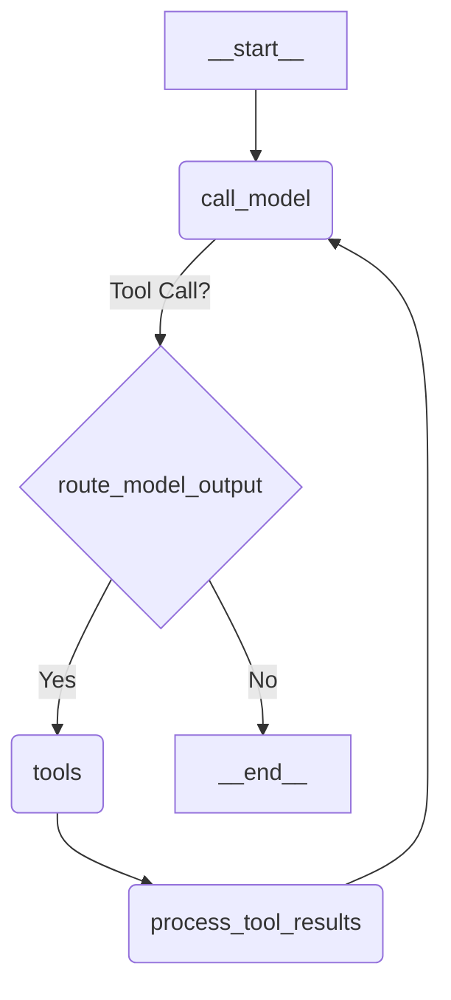

# Chat Agent Documentation

## 1. Project Overview

This document provides documentation for the `chat-agent` project. The agent is a conversational AI assistant built using Python and the LangChain/LangGraph framework. Its primary purpose is to interact with the Quantics financial statistics API, allowing users to request financial data analysis through natural language queries.

**Key Technologies:**

*   Python 3.x
*   LangChain & LangGraph
*   Pydantic (for data validation)
*   httpx (for asynchronous HTTP requests to the Quantics API)

## 2. Core Architecture (LangGraph)

The agent's execution logic is orchestrated using LangGraph, a library for building stateful, multi-actor applications with LLMs. The core graph is defined in `src/react_agent/graph.py`.

**Execution Flow:**

The agent operates as a state machine. The state transitions between different nodes based on the conversation progress and the LLM's decisions.

**Components:**

*   **State (`src/react_agent/state.py`):** A `State` object tracks the conversation history (`messages`) and other relevant data throughout the execution cycle.
*   **Nodes:**
    *   `call_model`: This node invokes the configured Large Language Model (LLM). The LLM receives the current conversation history and system prompt, then decides whether to respond directly to the user or to call a tool to gather more information.
    *   `tools`: If the LLM decides to use a tool, this `ToolNode` executes the requested Quantics API tool. It handles invoking the correct tool function based on the LLM's request.
    *   `process_tool_results`: After a tool is executed, this node takes the raw output from the `tools` node, parses it (checking for success/error), formats a summary message, and updates the state.
*   **Edges:** These define the possible transitions between nodes. The primary conditional edge routes the flow from `call_model` either to `tools` (if a tool call is requested) or to the end of the execution (`__end__`) if the LLM provides a direct response. After tool execution and processing, the flow loops back to `call_model`.

**Diagram:**

The following diagram illustrates the agent's execution graph:



## 3. Quantics Tools

The agent's primary capability comes from its integration with the Quantics financial statistics API via dynamically generated LangChain tools.

**Dynamic Tool Creation:**

Tools are not hardcoded. Instead, they are created dynamically at application startup based on configurations defined in `src/react_agent/stats_config.py`. The `create_quantics_tool` factory function in `src/react_agent/tools.py` reads this configuration and generates a corresponding LangChain tool for each defined statistic. These tools are collected in the `TOOLS` list, which is then used by the LangGraph `ToolNode`.

**Available Tools (from `stats_config.py`):**

*   **Volatility:** Fetches volatility analysis based on price fluctuations.
*   **Volume:** Fetches trading volume analysis.
*   **Cumulative Price:** Calculates and fetches accumulated price movement.
*(More tools can be added by editing `stats_config.py` - see "Adding New Quantics Tools" below)*

**Common Tool Input (`QuanticsToolInput`):**

All Quantics tools share the same input structure, defined by the `QuanticsToolInput` Pydantic model in `src/react_agent/tools.py`. This model enforces data validation for the parameters required by the Quantics API.

*   `asset` (AssetCode: Literal): Financial instrument code (e.g., "ES", "BTCUSDT"). Must be one of the predefined allowed codes.
*   `start_date` (int): Start date in YYYYMMDD format (e.g., 20230101). Validated range: 20120101 to 20241231.
*   `end_date` (int): End date in YYYYMMDD format. Validated range: 20120101 to 20241231. Must be >= `start_date`.
*   `bar_period` (int): Time frame for each bar in *minutes*. Must be >= 1.
*   `time_filters` (Dict[str, List[bool]]): Dictionary for time filtering. Requires keys:
    *   `months`: List of 12 booleans.
    *   `daysOfWeek`: List of 5 booleans (Mon-Fri).
    *   `daysOfMonth`: List of 31 booleans.
*   `trading_hours` (Dict[str, int]): Dictionary for trading hours. Requires keys:
    *   `startHour` (0-23), `startMin` (0-59)
    *   `endHour` (0-23), `endMin` (0-59)

**Modifying Input Validation:**

Input validation logic resides within the `QuanticsToolInput` model in `src/react_agent/tools.py`. Pydantic `@validator` decorators are used for this.

*   **Existing Rules:** You can modify existing validators (e.g., `end_date_must_be_after_start_date`, `validate_time_filters_structure`, `validate_trading_hours_structure`) to change constraints like date ranges or list lengths.
*   **Adding New Rules:** You can add new `@validator` methods to implement custom validation for specific fields or complex cross-field dependencies. Refer to the Pydantic documentation for details on creating validators.

**Common Tool Output (`QuanticsApiResponseModel`):**

The `_call_quantics_stat_api` function returns results structured according to the `QuanticsApiResponseModel` Pydantic model (defined in `src/react_agent/tools.py`). The `ToolNode` passes this structure (as a dictionary) to the `process_tool_results` node.

*   `success` (bool): Indicates if the API call was successful.
*   `charts_html` (Optional[str]): HTML content for charts, if generated by the API.
*   `metadata` (Optional[Dict[str, Any]]): Dictionary containing the specific statistical results from the API. The exact structure varies depending on the statistic called.
*   `error` (Optional[str]): Error message if the API call failed or an error occurred during processing.
*   `stat_output_description` (Optional[str]): A description of the expected output for the specific statistic called, sourced from `stats_config.py`.

**API Interaction (`_call_quantics_stat_api`):**

This asynchronous helper function in `src/react_agent/tools.py` handles the actual communication with the Quantics API endpoint for a given statistic.
1.  It retrieves authentication credentials using `get_quantics_auth`.
2.  It constructs the API request URL and JSON payload based on the `QuanticsToolInput` data.
3.  It makes the POST request using `httpx`.
4.  It parses the JSON response and maps it to the `QuanticsApiResponseModel`.
5.  It includes basic error handling for HTTP errors, request errors, and response processing errors.

**Authentication (`get_quantics_auth`):**

Authentication is handled by the `get_quantics_auth` function in `src/react_agent/tools.py`.

*   **Process:** It attempts to log in to the Quantics Firebase endpoint (`https://quantics.srl/firebase/login`) using email and password credentials.
*   **Credentials Source:**
    *   **Intended:** The function is designed to read credentials from environment variables (`QUANTICS_EMAIL`, `QUANTICS_PASSWORD`) loaded from a `.env` file.
    *   **Current State (Warning):** As of the last review, the code contains **hardcoded credentials** (`test@test.com`/`12345678`) for debugging purposes. **This is insecure and must be reverted to use environment variables for any production or shared use.**
*   **Output:** Returns a tuple `(userId, token)` upon successful login.
*   **Error Handling:** Raises `ValueError` if environment variables are missing (when not hardcoded) or `RuntimeError` if login fails.

**Adding New Quantics Tools:**

Adding support for a new statistic provided by the Quantics API is straightforward:

1.  **Identify API Endpoint:** Determine the exact name of the statistic endpoint used in the Quantics API URL (e.g., if the API URL is `https://quantics.srl/api/PriceChange`, the name is "PriceChange").
2.  **Update Configuration:** Open `src/react_agent/stats_config.py`. Add a new dictionary entry to the `AVAILABLE_STATS` list. This dictionary must include:
    *   `name`: The exact API endpoint name identified in Step 1 (e.g., `"PriceChange"`).
    *   `description`: A clear, concise description of what the statistic does. This description is crucial as the LLM uses it to decide when to call this tool (e.g., `"Fetches price change statistics between bars."`).
    *   `output_description`: A description of the expected data structure or key metrics found in the `metadata` field of the tool's output (e.g., `"The response metadata contains percentage and absolute price change values."`).
3.  **Restart Agent:** The dynamic tool creation mechanism in `tools.py` will automatically pick up the new entry in `AVAILABLE_STATS` the next time the application starts, creating and registering the new tool. No code changes in `tools.py` or `graph.py` are typically required, assuming the new statistic uses the standard `QuanticsToolInput` structure.

## 4. Configuration & Agent Behavior

The agent's behavior and settings can be customized through configuration.

**Configuration Class (`src/react_agent/configuration.py`):**

The `Configuration` dataclass defines the main configurable parameters:

*   `system_prompt` (str): The base instructions given to the LLM. Defaults to `SYSTEM_PROMPT` from `src/react_agent/prompts.py`.
*   `model` (str): The identifier for the LLM to use (e.g., "openai/gpt-4o"). Defaults to "openai/gpt-4o".
*   `max_search_results` (int): (Purpose currently unclear in the context of Quantics tools, may be for other potential tools). Defaults to 10.

Configuration values are typically passed to the LangGraph execution environment via a `RunnableConfig` object. The `Configuration.from_runnable_config` class method handles loading these values.

**Influencing Agent Behavior & Tool Usage:**

Several factors influence how the agent interprets user requests and decides to use tools:

*   **System Prompt (`prompts.py` / `Configuration.system_prompt`):** This is the most direct way to shape the agent's persona, its understanding of its capabilities, and its conversational style. Modifying the `SYSTEM_PROMPT` in `prompts.py` or overriding it via configuration changes the core instructions given to the LLM at the start of each interaction. For example, you could instruct it to always ask clarifying questions or to prefer certain tools.
*   **Tool Descriptions (`stats_config.py`):** The `description` field for each tool in the `AVAILABLE_STATS` list is critical for tool selection. The LLM analyzes the user's request and compares it against these descriptions to determine the most appropriate tool(s) to call. Clear, accurate, and distinct descriptions are essential for reliable tool usage. Vague or overlapping descriptions can confuse the LLM.
*   **LLM Choice (`Configuration.model`):** Different LLMs have varying capabilities in understanding instructions, following reasoning steps, and correctly formatting tool calls. Choosing a powerful and instruction-following model (like GPT-4) generally leads to better performance in complex agentic tasks.

**Guiding Correct JSON Tool Input Generation:**

The agent relies on the LLM's ability to generate correctly formatted JSON input for the selected tool. LangChain facilitates this:

1.  **Schema Exposure:** When tools are created using the `@tool` decorator and a Pydantic model is provided as the type hint for the input argument (like `input_data: QuanticsToolInput` in `tools.py`), LangChain automatically generates a JSON Schema representation of that Pydantic model.
2.  **Binding to LLM:** This schema is provided to the LLM when the tools are bound using `.bind_tools(ALLOWED_TOOLS)` in `graph.py`.
3.  **LLM Generation:** Modern LLMs are trained to understand JSON Schema and generate JSON objects that conform to it when requested to use a tool.
4.  **Pydantic Descriptions:** The `description` fields within the `QuanticsToolInput` Pydantic model itself (e.g., `description="Start date in YYYYMMDD format..."`) are also included in the schema provided to the LLM. These descriptions act as further guidance, helping the LLM understand the *meaning* and expected format of each parameter, leading to more accurate JSON generation. Clear descriptions within the Pydantic model are therefore important for robust tool input formatting.

## 5. State Management (`src/react_agent/state.py`)

LangGraph uses a state object to pass information between nodes in the graph. This agent defines its state structure in `src/react_agent/state.py`.

**State Classes:**

*   **`InputState`:** Defines the expected input structure when the graph execution starts. Primarily contains the initial `messages`.
*   **`State(InputState)`:** Represents the complete, internal state of the agent during execution. It inherits from `InputState` and adds graph-specific fields.

**Key State Attributes:**

*   **`messages` (Annotated[Sequence[AnyMessage], add_messages]):** This is the core of the state, tracking the conversation history. It typically accumulates:
    1.  `HumanMessage` (User input)
    2.  `AIMessage` (Agent response, potentially with `tool_calls`)
    3.  `ToolMessage` (Result of tool execution)
    The `add_messages` annotation ensures new messages are appended correctly, maintaining the conversational flow.
*   **`is_last_step` (IsLastStep):** A boolean flag managed automatically by LangGraph. It becomes `True` just before the final allowed step (determined by the graph's recursion limit) is executed, allowing nodes like `call_model` to provide a fallback response if they would otherwise attempt a tool call.
*   **`tool_parameters` (Optional[Dict[str, Any]]):** An optional dictionary intended to hold parameters for a tool call. (Note: Current implementation in `graph.py` doesn't seem to explicitly use this field).
*   **`structured_tool_output` (Optional[Dict[str, Any]]):** An optional dictionary intended to hold the structured result from a tool call after parsing. (Note: Current implementation in `graph.py` doesn't seem to explicitly use this field, though `process_tool_results` parses the output).

The `State` class can be extended with additional fields if more information needs to be passed between graph nodes during execution.

## 6. Utilities (`src/react_agent/utils.py`)

The `utils.py` module contains helper functions used elsewhere in the agent code:

*   **`load_chat_model(fully_specified_name: str) -> BaseChatModel`:** Takes a model identifier string (e.g., "openai/gpt-4o") and uses LangChain's `init_chat_model` to load and return the corresponding chat model instance.
*   **`get_message_text(msg: BaseMessage) -> str`:** Extracts the textual content from various LangChain message types (`BaseMessage`), handling different content structures (string, list, dictionary).

## 7. Setup & Usage

**Dependencies:**

*   Project dependencies are managed using `pyproject.toml` and likely `poetry` or `pip`. Install dependencies using the appropriate tool (`python -m pip install -e .`).

**Configuration:**

*   **Quantics API Credentials:** The agent requires credentials to access the Quantics API. Create a `.env` file in the `chat-agent` root directory and add your credentials:
    ```dotenv
    QUANTICS_EMAIL=your_quantics_email@example.com
    QUANTICS_PASSWORD=your_quantics_password
    ```
    **(Remember to remove the hardcoded credentials from `tools.py` if they are still present!)**
*   **LLM API Keys:** Ensure necessary API keys for the chosen LLM provider (e.g., OpenAI) are set as environment variables (e.g., `OPENAI_API_KEY`).

**Running the Agent:**

*   (The exact command to run the agent is not specified in the reviewed code. It likely involves running a Python script that initializes and invokes the LangGraph graph, potentially using a framework like LangServe or FastAPI if it's intended to be a service. Refer to the project's main entry point or `Makefile` if available.)

## 8. Testing

The project includes a `tests/` directory, indicating the presence of automated tests:

*   `tests/unit_tests/`: Contains unit tests for individual components (e.g., `test_configuration.py`).
*   `tests/integration_tests/`: Contains integration tests that likely test the interaction between multiple components or the full agent graph (e.g., `test_graph.py`).
*   `tests/cassettes/`: Suggests the use of `vcr.py` or a similar library for recording and replaying HTTP interactions (like Quantics API calls) during testing, avoiding actual API calls on subsequent test runs.

Run tests using a test runner like `pytest`.